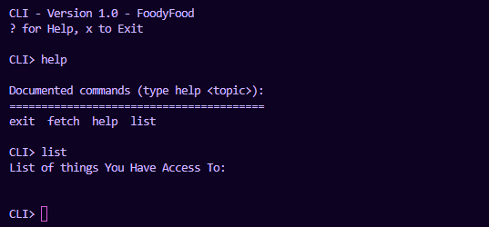

# Python TTY CLI Interface

A teletype command line interface template for python.

A Captive interface that reads and interprits inputs by the user.


### Running

```bash
python3 ./tty.py
```
The interface has help commands and will also exit gracefully if the user presses `CTRL + C`



